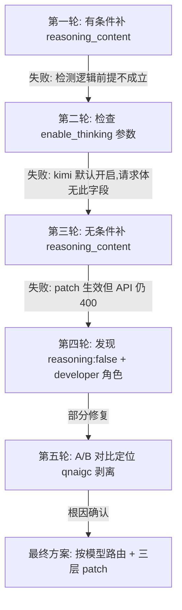

> 记录时间: 2026-02-07
> 环境: Mac Mini M4 (192.168.3.196)
> 状态: **已解决** — 两类问题分别修复

## 错误现象

```
HTTP 400: thinking is enabled but reasoning_content is missing
in assistant tool call message at index 5
(type: invalid_request_error)
```

kimi-k2.5 开启 thinking 模式后，触发 tool call 即报 400。排查发现这并非单一问题，而是**两类独立问题的叠加**。

---

# 问题一：qnaigc 代理剥离扩展字段

## 问题域

请求链路 `OpenClaw → proxy.js → api.qnaigc.com → api.moonshot.cn` 中，==qnaigc 代理网关在转发时剥离了 `reasoning_content` 字段==。

## 根因分析

`api.qnaigc.com` 是 OpenAI 兼容的 API 中转平台，其转发逻辑只保留 OpenAI 标准 Chat Completions API 定义的字段。`reasoning_content` 是 Moonshot 对 OpenAI 规范的扩展字段，不在 OpenAI 标准中，因此被 qnaigc 在转发时静默剥离。

这意味着：
- proxy.js 虽然正确地在请求体中补充了 `reasoning_content: ""`
- 但请求经过 qnaigc 后，该字段被再次移除
- Moonshot API 收到的 assistant 消息缺少 `reasoning_content`，返回 400

### 定位过程

关键突破来自 **A/B 对比测试**：

```javascript
// 同一个请求体，两条路径：
// 路径 A: proxy.js → api.qnaigc.com → api.moonshot.cn → 400 ❌
// 路径 B: proxy.js → api.moonshot.cn (直连)          → 200 ✅
```

这直接证明问题出在 qnaigc 这一跳。

### 数据流可视化

```
请求体 (含 reasoning_content: "")
    │
    ▼
api.qnaigc.com  ──── 剥离非标准字段 ────→  reasoning_content 消失
    │
    ▼
api.moonshot.cn  ──── thinking=on 要求该字段 ────→  400 错误
```

## 修复方案：按模型路由

proxy.js 根据 `model` 字段决定路由目标，kimi 请求绕过 qnaigc 直连 Moonshot API：

```javascript
const CONFIG = {
  defaultTarget: "api.qnaigc.com",  // deepseek, glm 等
  tokens: ["sk-...", "sk-..."],     // qnaigc 轮换 token
  kimiTarget: "api.moonshot.cn",    // kimi 直连
  kimiApiKey: "sk-...",             // Moonshot API key
};

// 路由判断
if (result.isKimi) {
  target = CONFIG.kimiTarget;
  authToken = CONFIG.kimiApiKey;
}
```

### proxy.js 对 kimi 请求的三个 patch

即使直连 Moonshot，proxy 仍需做以下适配：

| Patch | 原因 | 操作 |
|-------|------|------|
| Model ID 重写 | OpenClaw 发送 `moonshotai/kimi-k2.5`（含 provider 前缀），Moonshot API 只识别 `kimi-k2.5` | `model.split("/").pop()` |
| `developer` → `system` | OpenClaw thinking 模式将 system prompt 角色改为 `developer`，kimi 不支持 | 遍历 messages 替换 role |
| 补充 `reasoning_content: ""` | 历史 assistant 消息可能缺少该字段，thinking=on 时 Moonshot 要求必须存在 | 为缺失字段的 assistant 消息补空串 |

> [!note] 为什么直连后还需要 patch？
> 直连解决的是"字段被中间层剥离"的问题。但 OpenClaw 自身发出的请求本身就存在与 kimi API 不兼容的地方（见问题二），这些需要 proxy 层修正。

---

# 问题二：OpenClaw 与 kimi API 的兼容性

## 问题域

OpenClaw 框架的 thinking 模式实现参照的是 OpenAI o1/o3 系列的行为约定，与 kimi API 的约定存在差异，导致即使网络链路正确也会报错。

## 根因分析

### 2a. `reasoning: false` 导致 thinking 未开启

**现象**: OpenClaw 运行日志显示 `thinking=off`，尽管配置了 `thinkingDefault: "medium"`。

**原因**: 模型定义中的 `reasoning` 字段优先级高于 `thinkingDefault`：

```
优先级: reasoning (模型定义) > thinkingDefault (全局默认)
```

当 `reasoning: false` 时，OpenClaw 认为该模型不支持 thinking，直接忽略 `thinkingDefault`。结果：
- OpenClaw 不在请求中声明 thinking 模式
- 但 kimi-k2.5 的 API **默认开启 thinking**（不需要显式 `enable_thinking` 参数）
- 模型返回含 `reasoning_content` 的响应，OpenClaw 不理解该字段
- 后续对话中 assistant 消息缺少 `reasoning_content`，kimi API 报 400

**修复**: `reasoning: false` → `reasoning: true`，需重启 gateway。

> [!warning] config hot-reload 的局限
> `thinkingDefault` 和 `subagents.thinking` 可以热重载生效，但 `reasoning` 标志需要**重启 gateway** 才能更新。这是因为 `reasoning` 在 gateway 启动时被读入模型能力元数据，运行期间不再重新读取。

### 2b. `developer` 角色不被 kimi 支持

**现象**: 修复 reasoning 后出现新的 400：

```
do not support role developer for model moonshotai/kimi-k2.5
support role: [system assistant user tool]
```

**原因**: OpenClaw 的 thinking 模式模仿 OpenAI o1 的行为，将 `system` 角色自动改为 `developer`。这是 OpenAI 在 o1 系列中引入的约定——thinking 模型不接受 `system` prompt，而用 `developer` prompt 替代。

kimi API 虽然也是 thinking 模型，但不遵循这一约定，只支持 `system/assistant/user/tool` 四种角色。

**修复**: proxy.js 中 `developer` → `system` 的 role 替换。

### 2c. 历史消息缺少 `reasoning_content`

**现象**: 即使当前请求的 thinking 正确开启，**之前 thinking=off 时产生的历史 assistant 消息**不含 `reasoning_content` 字段。kimi API 在 thinking=on 时要求所有 assistant 消息都包含该字段。

**原因**: 这是一个状态不一致问题。在 `reasoning: false` → `reasoning: true` 切换后，OpenClaw 的对话历史中混合了两种状态的消息：

```
messages[0]: system → 无 reasoning_content (正常)
messages[1]: user → 无 reasoning_content (正常)
messages[2]: assistant → 无 reasoning_content ❌ (thinking=off 时产生)
messages[3]: user → ...
messages[4]: assistant → reasoning_content: "..." ✅ (thinking=on 后产生)
messages[5]: assistant (tool_call) → 无 reasoning_content ❌ (tool call 天然不含)
```

**修复**: proxy.js 无条件为缺失 `reasoning_content` 的 assistant 消息补 `""`。

> [!tip] OpenClaw 框架层面的缺失
> OpenClaw 有 `downgradeOpenAIReasoningBlocks()` 函数用于 reasoning → non-reasoning 降级，但**缺少反向的 upgrade 逻辑**（non-reasoning → reasoning 升级）。目前由 proxy 层弥补这一缺失。

---

# 排查时间线



| 轮次 | 假设 | 结果 | 教训 |
|------|------|------|------|
| 1 | 检测已有 reasoning_content 推断 thinking 状态 | ❌ 首轮无 thinking 消息，条件不成立 | 不能靠消息内容推断模型配置 |
| 2 | 请求体含 `enable_thinking: true` | ❌ kimi 默认开启，请求体无此字段 | kimi thinking 是 API 默认行为 |
| 3 | 无条件补字段即可 | ❌ 补了但 qnaigc 又剥了 | 中间层可能篡改请求体 |
| 4 | reasoning 配置和角色问题 | ⚠️ 修复了部分，仍有 400 | 多层问题需逐层排除 |
| 5 | 对比直连 vs 代理 | ✅ 定位根因 | A/B 测试是定位链路问题的利器 |

---

# 修复汇总

## 架构变更

```
修复前:
OpenClaw → proxy.js → api.qnaigc.com → api.moonshot.cn
                          ↑ reasoning_content 被剥离

修复后:
OpenClaw → proxy.js ─┬→ api.moonshot.cn (kimi, 直连)
                     └→ api.qnaigc.com  (其他模型, token 轮换)
```

## 配置变更

```diff
# openclaw.json 模型定义
- "reasoning": false
+ "reasoning": true

# agents.defaults
- "thinkingDefault": "off"
+ "thinkingDefault": "medium"

# subagents
- "thinking": "off"
+ "thinking": "medium"
```

## proxy.js 核心函数

```javascript
function patchAndRoute(body) {
  // 1. 检测 kimi 模型 → isKimi = true
  // 2. 去掉 provider 前缀: moonshotai/kimi-k2.5 → kimi-k2.5
  // 3. developer → system
  // 4. 补充缺失的 reasoning_content: ""
  // 返回 { body, isKimi } 供路由决策
}
```

---

# 进一步思考

## 1. qnaigc 中转的普遍性风险

> [!danger] 核心教训
> 任何使用非标准扩展字段的模型，都不应经过 qnaigc 这类"OpenAI 兼容"中转。

qnaigc 剥离字段的行为不是 bug，而是其设计意图——只转发 OpenAI 标准字段以保证兼容性。这意味着：

- **DeepSeek R1** 如果未来在 assistant 消息中使用 `reasoning_content`，同样会被剥离
- 任何模型的**非标准扩展字段**（如自定义 metadata、usage 扩展等）都有风险
- 应将"是否需要直连"作为模型接入时的标准评估项

## 2. proxy.js 路由策略的可扩展性

当前路由逻辑基于 `model.includes("kimi")` 硬编码。如果未来需要更多模型直连（如 DeepSeek thinking 模式），建议改为配置驱动：

```javascript
// 当前: 硬编码
if (json.model.includes("kimi")) { isKimi = true; }

// 未来: 配置化路由表
const DIRECT_ROUTES = {
  "kimi": { target: "api.moonshot.cn", apiKey: "sk-..." },
  "deepseek": { target: "api.deepseek.com", apiKey: "sk-..." },
};
```

详见 → [[proxy静态路由策略重构]]

## 3. OpenClaw 框架的 thinking 兼容性

OpenClaw 的 thinking 模式假设了 OpenAI o1 的行为约定，但不同厂商的实现差异很大：

| 行为 | OpenAI o1/o3 | kimi-k2.5 | DeepSeek R1 |
|------|-------------|-----------|-------------|
| thinking 开关 | 显式参数 | API 默认开启 | 显式参数 |
| system prompt | 用 `developer` 替代 | 仍用 `system` | 仍用 `system` |
| `reasoning_content` | 标准字段 | 必须存在 | 可选 |
| 历史消息要求 | 可选 | 所有 assistant 必须有 | 可选 |

**建议**: 在 OpenClaw 框架层面增加 per-model 的 thinking behavior profile，而不是一刀切地套用 OpenAI 约定。

## 4. upgrade 逻辑的缺失

OpenClaw 有 `downgradeOpenAIReasoningBlocks()` 但缺少反向的 upgrade。当用户在对话中途切换模型（从 non-thinking 到 thinking），历史消息中的 assistant 消息不含 `reasoning_content`，会导致 thinking 模型报错。

**理想方案**: 在框架层实现 `upgradeReasoningBlocks()`，在发送请求前检查并补充缺失的 `reasoning_content`。当前由 proxy 层兜底，但这不是架构上的正确位置。

## 5. 调试方法论沉淀

> [!abstract] 多跳链路问题的调试范式
> 1. **先确认终端行为**: 直连最终 API，确认请求体本身是否正确
> 2. **逐跳排除**: 从终端向前逐跳加入中间层，定位哪一跳引入问题
> 3. **A/B 对比**: 同一请求体，不同路径，是最高效的定位手段
> 4. **不要信任中间层**: 即使中间层声称"透明转发"，也要验证

---

# 相关文件

| 文件 | 说明 |
|------|------|
| `/opt/qnaigc-proxy/proxy.js` | 代理服务（路由 + patch） |
| `~/.openclaw/openclaw.json` | 主配置 |
| `~/Library/LaunchAgents/ai.openclaw.gateway.plist` | Gateway 启动配置 |
| `/Library/LaunchDaemons/com.agentteam.qnaigc-proxy.plist` | Proxy 启动配置 |

# 服务管理命令

```bash
# Proxy 服务
sudo launchctl kickstart -k system/com.agentteam.qnaigc-proxy
tail -f /opt/qnaigc-proxy/proxy.log
tail -f /opt/qnaigc-proxy/proxy-error.log

# Gateway 服务
launchctl kickstart -k gui/$(id -u)/ai.openclaw.gateway
tail -f ~/.openclaw/logs/gateway.log

# 运行时日志
tail -f /tmp/openclaw/openclaw-$(date +%Y-%m-%d).log
```
